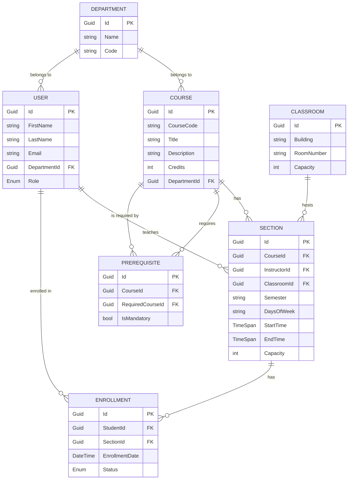

# Entity Relationship Diagram

This diagram represents the database schema for the University Course Scheduling and Management System.

```mermaid
erDiagram
    DEPARTMENT ||--o{ COURSE : "belongs to"
    DEPARTMENT ||--o{ USER : "belongs to"
    COURSE ||--o{ SECTION : "has"
    COURSE ||--o{ PREREQUISITE : "requires"
    COURSE ||--o{ PREREQUISITE : "is required by"
    USER ||--o{ SECTION : "teaches"
    USER ||--o{ ENROLLMENT : "enrolled in"
    SECTION ||--o{ ENROLLMENT : "has"
    CLASSROOM ||--o{ SECTION : "hosts"

    DEPARTMENT {
        Guid Id PK
        string Name
        string Code
    }

    USER {
        Guid Id PK
        string FirstName
        string LastName
        string Email
        Guid DepartmentId FK
        Enum Role
    }

    COURSE {
        Guid Id PK
        string CourseCode
        string Title
        string Description
        int Credits
        Guid DepartmentId FK
    }

    SECTION {
        Guid Id PK
        Guid CourseId FK
        Guid InstructorId FK
        Guid ClassroomId FK
        string Semester
        string DaysOfWeek
        TimeSpan StartTime
        TimeSpan EndTime
        int Capacity
    }

    CLASSROOM {
        Guid Id PK
        string Building
        string RoomNumber
        int Capacity
    }

    ENROLLMENT {
        Guid Id PK
        Guid StudentId FK
        Guid SectionId FK
        DateTime EnrollmentDate
        Enum Status
    }

    PREREQUISITE {
        Guid Id PK
        Guid CourseId FK
        Guid RequiredCourseId FK
        bool IsMandatory
    }
```
